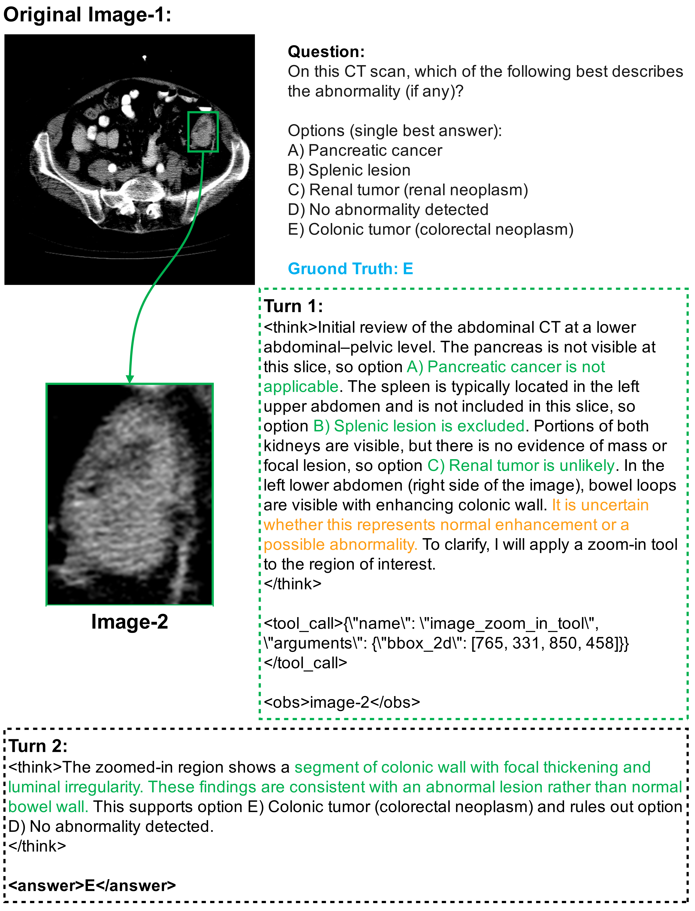

<div align="center">
<h1>  Ophiuchus: Incentivizing Tool-augmented Thinking with Images for Medical Image Analysis </h1>
<h4 align="center">
    Tool-augmented “think with images” for medical AI: decide <i>when</i> to look again, <i>where</i> to zoom/segment, and <i>how</i> to ground reasoning with visual evidence.
  </h4>
</div>

<h4 align="center"> If you find this project useful, please give us a star🌟.<h4 align="center"> 


## ⚡Introduction 


**Ophiuchus** is a versatile *“think with images”* framework for medical image analysis:
instead of relying on a single global glance, it teaches an MLLM to **iteratively gather fine-grained visual evidence** during reasoning:

- **When** to request more visual evidence (vs. answer directly)
- **Where** to probe & ground (target regions / lesions / structures)
- **How** to *weave* localized sub-image content back into an **interleaved multimodal chain-of-thought**

Unlike “static” reasoning that never looks again, Ophiuchus runs a **Thought → Tool → Observation** loop until a confident final answer.

---

## 🔥 Key Highlights

- **3-tool agentic toolbox**: segmentation + zoom-in for *precise* visual grounding
- **64K Tool-Integrated VQA** with explicit tool trajectories and region grounding
- **3-stage training recipe** that turns a base MLLM into a tool-using visual reasoner:
  1) cold-start SFT → 2) self-reflection fine-tuning → 3) agentic tool RL (ATRL)
- **Strong & consistent gains** across *multiple* medical benchmarks, outperforming both open and closed baselines
- **Training-free generalization to unseen tools** (swap in a new segmentation tool and still work)

---

## 🧩 Framework Overview

<div align="center">
  
</div>

Ophiuchus is trained to produce **interleaved** reasoning traces:
- `<think>`: textual reasoning
- `<tool_call>/Action`: invoke image tools for region proposals / segmentation / zoom-in
- `<obs>`: tool outputs (masks, crops, overlays) injected back into the context

---

## 🧰 Toolbox

We equip Ophiuchus with **three** tools (segmentation ×2 + zoom-in ×1):

1. **SAM2**: segmentation given **bboxes** proposed by the MLLM (fast + strong masks)
2. **BiomedParse**: **text-driven** segmentation (delegates region localization to the tool when bboxes are unreliable)
3. **Zoom-In**: crops fine-grained regions given **bboxes or masks**; with masks, it can also outline contours to make boundary morphology explicit

> In practice: Ophiuchus learns to mix-and-match tools depending on the case difficulty and what evidence is missing.

---

## 🩺 Case Showcase

Below are a few **representative qualitative cases** (more details, captions, and additional examples are provided in the paper).

### 1) Visual-Cue Search (Find the right evidence)
<div align="center">
  
</div>

**Pattern:** the model first admits “a global view is insufficient”, then uses segmentation to propose candidate regions and zoom-in to verify subtle cues, finally aggregating evidence into a reliable conclusion.

---

### 2) Confirmation via Zoom-In (Verify before committing)
<div align="center">
  
</div>

**Pattern:** after a tentative hypothesis, the model performs targeted zoom-ins to confirm key visual signatures and reduce uncertainty.

---

### 3) Hallucination Mitigation (Correct itself with tools)
<div align="center">
  
</div>

**Pattern:** the model detects a mismatch between its text reasoning and the visual evidence, re-invokes tools to re-check the image, then revises the answer grounded in the retrieved evidence.

---

## 🧪 Data Preparation

This repo provides **training scripts** and a **minimal data format example**.

### SFT data (tool-integrated trajectories)
A minimal example is provided here:

- `./data/example/data_case/biomedparser-SFT.json`

### RL data (one-case schema example)
RL data is a list of records. Below is a **single simplified case** (no real paths/values required):

```json
{
  "question_id": 1,
  "question_type": "multiple choice | segmentation | open-ended | yes/no",
  "question": "string (the prompt/question)",
  "answer": "string (GT label or text answer)",
  "options": ["string list (only for MCQ / constrained answers)"],
  "data_type": "vqa | seg",
  "image_path": ["string list (one or multiple images)"],
  "source": "string (e.g., BioMedParse)",
  "mask_path": ["string list (only for seg tasks, optional)"],
  "max_steps": 6
}
```

---

## 🏋️ Training
### Installation
```bash
# Please install verl from our repository. 
# This will help you better visualize the changing trends of each component in the reward during the training process.
cd verl 
pip install -e .
```
### Start !!!
For RL training, please specify the configuration in `./run.sh`, including the TRAIN_DATA and MODEL_PATH, as well as the configuration variables related to SCORE.
```bash
# You can customize and adjust the training parameters according to your hardware capabilities to avoid OOM.
bash ./run.sh
```

## 🤔 Model
| Model             | Base Model                                                   | Link                                                       | GPU Memory   | 
| ----------------- | ------------------------------------------------------------ | ---------------------------------------------------------- | ------------ |
| Thoth-mini     | [Qwen3-4B](https://huggingface.co/Qwen/Qwen3-4B) | [Wait]()      | 8GB |  
| Thoth   | [Qwen3-8B](https://huggingface.co/Qwen/Qwen3-8B) | [Wait]()   | 17GB |

We provide a simple inference script in `./infer.py`.

## 🧑‍⚖️ Evaluation 

You can use the script we provide in `./eval/eval_batch.py` to evaluate the Scirecipe-Eval benchmark (it may require slight modifications). Below are the specific instructions.

## 🏁 Results

Main results on SciRecipe-Eval. Metrics left of the dashed line evaluate executability, those on the right measure lexical similarity. Bold denotes the best score.

<div align=center>

</div>

<div align=center>

</div>

## 🐎 TODO
- Improve repository structure and documentation to enhance readability.
- Release **Thoth** model checkpoints on HuggingFace.
- Publish the **SciRecipe** dataset on HuggingFace.
- Address community feedback and resolve reported issues.


## 🙏🏼 Acknowledgement

We gratefully acknowledge the inspiring work of [VERL](https://github.com/volcengine/verl) and [MinerU](https://github.com/opendatalab/MinerU) which have provided essential foundations and inspiration for this project. We also thank the developers of these outstanding tools for their contributions to open-source innovation.

## 📖 Citation

```bash
Under Review ICLR 2026
```
