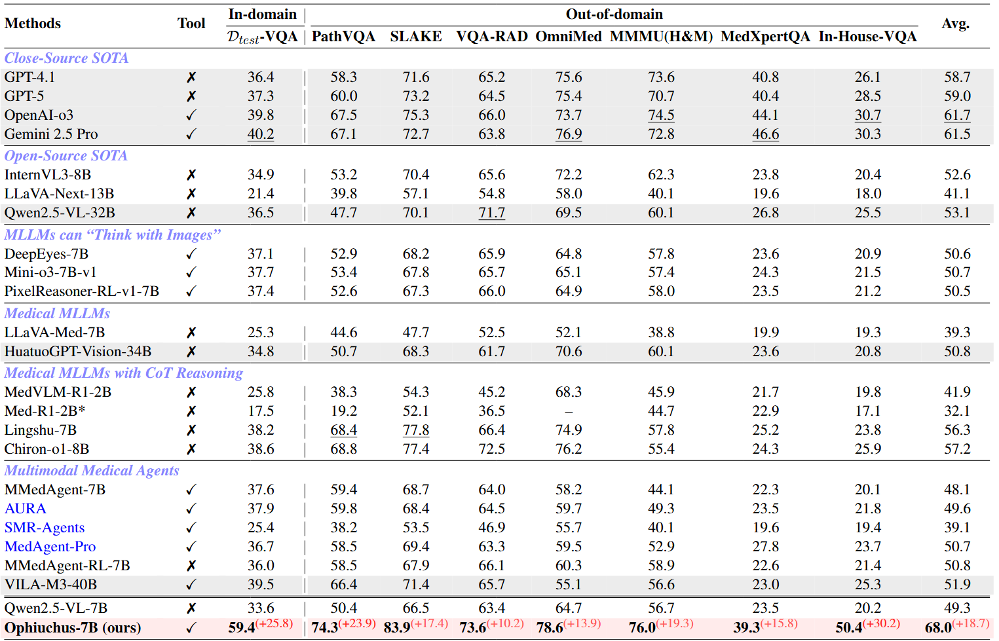

<div align="center">
<h1>  Ophiuchus: Incentivizing Tool-augmented Thinking with Images for Medical Image Analysis </h1>
<h4 align="center">
    Tool-augmented “think with images” for medical AI: decide <i>when</i> to look again, <i>where</i> to zoom/segment, and <i>how</i> to ground reasoning with visual evidence.
  </h4>
</div>

<h4 align="center"> If you find this project useful, please give us a star🌟.<h4 align="center"> 


## ⚡Introduction 


**Ophiuchus** is a versatile *“think with images”* framework for medical image analysis:
instead of relying on a single global glance, it teaches an MLLM to **iteratively gather fine-grained visual evidence** during reasoning:

- **When** to request more visual evidence (vs. answer directly)
- **Where** to probe & ground (target regions / lesions / structures)
- **How** to *weave* localized sub-image content back into an **interleaved multimodal chain-of-thought**

Unlike “static” reasoning that never looks again, Ophiuchus runs a **Thought → Tool → Observation** loop until a confident final answer.

---

## 🔥 Key Highlights

- **3-tool agentic toolbox**: segmentation + zoom-in for *precise* visual grounding
- **64K Tool-Integrated VQA** with explicit tool trajectories and region grounding
- **3-stage training recipe** that turns a base MLLM into a tool-using visual reasoner:
  1) cold-start SFT → 2) self-reflection fine-tuning → 3) agentic tool RL (ATRL)
- **Strong & consistent gains** across *multiple* medical benchmarks, outperforming both open and closed baselines
- **Training-free generalization to unseen tools** (swap in a new segmentation tool and still work)

---

## 🧩 Framework Overview

<div align="center">
  
</div>

Ophiuchus is trained to produce **interleaved** reasoning traces:
- `<think>`: textual reasoning
- `<tool_call>/Action`: invoke image tools for region proposals / segmentation / zoom-in
- `<obs>`: tool outputs (masks, crops, overlays) injected back into the context

---

## 🧰 Toolbox

We equip Ophiuchus with **three** tools (segmentation ×2 + zoom-in ×1):

1. **SAM2**: segmentation given **bboxes** proposed by the MLLM (fast + strong masks)
2. **BiomedParse**: **text-driven** segmentation (delegates region localization to the tool when bboxes are unreliable)
3. **Zoom-In**: crops fine-grained regions given **bboxes or masks**; with masks, it can also outline contours to make boundary morphology explicit

> In practice: Ophiuchus learns to mix-and-match tools depending on the case difficulty and what evidence is missing.

---

## 🩺 Case Showcase

Below are a few **representative qualitative cases** (more details, captions, and additional examples are provided in the paper).

### 1) Visual-Cue Search (Find the right evidence)
<div align="center">
  
</div>

**Pattern:** the model first admits “a global view is insufficient”, then uses segmentation to propose candidate regions and zoom-in to verify subtle cues, finally aggregating evidence into a reliable conclusion.

---

### 2) Confirmation via Zoom-In (Verify before committing)
<div align="center">
  
</div>

**Pattern:** after a tentative hypothesis, the model performs targeted zoom-ins to confirm key visual signatures and reduce uncertainty.

---

### 3) Hallucination Mitigation (Correct itself with tools)
<div align="center">
  
</div>

**Pattern:** the model detects a mismatch between its text reasoning and the visual evidence, re-invokes tools to re-check the image, then revises the answer grounded in the retrieved evidence.

---

## 🧪 Data Preparation

This repo provides **training scripts** and a **minimal data format example**.

### SFT data (tool-integrated trajectories)
A minimal example is provided here:

- `./data/example/data_case/biomedparser-SFT.json`

### RL data (one-case schema example)
RL data is a list of records. Below is a **single simplified case** (no real paths/values required):

```json
{
  "question_id": 1,
  "question_type": "multiple choice | segmentation | open-ended | yes/no",
  "question": "string (the prompt/question)",
  "answer": "string (GT label or text answer)",
  "options": ["string list (only for MCQ / constrained answers)"],
  "data_type": "vqa | seg",
  "image_path": ["string list (one or multiple images)"],
  "source": "string (e.g., BioMedParse)",
  "mask_path": ["string list (only for seg tasks, optional)"],
  "max_steps": 6
}
```

---

## 🏋️ Training
### Installation verl
```bash
# Please install verl from our repository. 
# This will help you better visualize the changing trends of each component in the reward during the training process.
conda create -n verl-agent python==3.12 -y
conda activate verl-agent

pip3 install torch==2.6.0 --index-url https://download.pytorch.org/whl/cu124
pip3 install flash-attn==2.7.4.post1 --no-build-isolation

pip3 install -e .

pip3 install vllm==0.8.5
```

### Install Toolbox Environments
> ⚠️ **Important:** 
To run an agent in any of these environments, you must first install and configure the corresponding environment. We strongly recommend installing ***each environment in its own dedicated conda environment*** to avoid potential package version conflicts.

#### 1. SAM 2
SAM 2 needs to be installed first before use. The code requires `python>=3.10`, as well as `torch>=2.5.1` and `torchvision>=0.20.1`. Please follow the instructions [here](https://pytorch.org/get-started/locally/) to install both PyTorch and TorchVision dependencies. You can install SAM 2 on a GPU machine using:
```bash
cd ./examples/env_server/sam2/sam2

pip install -e .
```
We need to download a model checkpoint. All the model checkpoints can be downloaded by running:
```bash
cd ./examples/env_server/sam2/checkpoints && \
./download_ckpts.sh && \
cd ..
```
or individually from:

- [sam2.1_hiera_tiny.pt](https://dl.fbaipublicfiles.com/segment_anything_2/092824/sam2.1_hiera_tiny.pt)
- [sam2.1_hiera_small.pt](https://dl.fbaipublicfiles.com/segment_anything_2/092824/sam2.1_hiera_small.pt)
- [sam2.1_hiera_base_plus.pt](https://dl.fbaipublicfiles.com/segment_anything_2/092824/sam2.1_hiera_base_plus.pt)
- [sam2.1_hiera_large.pt](https://dl.fbaipublicfiles.com/segment_anything_2/092824/sam2.1_hiera_large.pt)

---

#### 2. BiomedParse
Create a new conda environment from scratch:
```bash
cd ./examples/env_server/BiomedParse/BiomedParse-main 
conda create -n biomedparse python=3.9.19
conda activate biomedparse
```

Install Pytorch
```sh
conda install pytorch torchvision torchaudio pytorch-cuda=12.4 -c pytorch -c nvidia
```

Install dependencies
```sh
pip install -r assets/requirements/requirements.txt
```

Please download the Hugging Face model [openai/clip-vit-base-patch32](https://huggingface.co/openai/clip-vit-base-patch32) into `/openai/clip-vit-base-patch32`, and download [microsoft/BiomedNLP-BiomedBERT-base-uncased-abstract-fulltext](https://huggingface.co/microsoft/BiomedNLP-BiomedBERT-base-uncased-abstract-fulltext) into `BiomedParse-main/microsoft/BiomedNLP-BiomedBERT-base-uncased-abstract-fulltext`.

---

<!-- > ⚠️ **Important:**  
To run an agent in any of these environments, you must first install and configure the corresponding environment. Please refer to the [SAM Setup Guide](/examples/env_server/sam2/sam2/README.md) and [BiomedParse Setup Guide](/examples/env_server/BiomedParse/BiomedParse-main/README.md) for step-by-step installation instructions. -->

### Start !!!
First, run cold-start SFT and Self-Reflection Fine-Tuning. Please specify the configuration in `/scripts/SFT/cold-start/my_qwen2_5vl_lora_sft.yaml` and `/scripts/SFT/reflective_rejection_fine_tuning/config_reflective.yaml`, including the `dataset` and `model_name_or_path` fields.
### Stage A — Cold-start SFT
```bash 
bash ./scripts/SFT/cold-start/train_cold_start.sh
```
### Stage B — Self-reflection Fine-tuning
```bash 
bash ./scripts/SFT/reflective_rejection_fine_tuning/train_reflective.sh
```
### Stage C — Agentic Tool RL (ATRL)
For RL training, please start the external ToolBox first as a local API service.
#### Start tool servers 

**1) Start the SAM2 server**
You can set your local port and `CUDA_VISIBLE_DEVICES`.
```bash
bash ./examples/env_server/start_sam2_server.sh
```
**2) Start the BiomedParse server**
You can set your local port and `CUDA_VISIBLE_DEVICES`, and you may also adjust the `CLIP` and `BIOMEDBERT` paths as needed.
```bash
bash ./examples/env_server/start_biomedparse_server.sh
```

#### Start RL (GRPO)
GRPO is a critic-free algorithm that estimates relative advantages based on a group of full episode trajectories.
```bash
# You can customize and adjust the training parameters according to your hardware capabilities to avoid OOM.
bash /examples/grpo_trainer/run_ATRL.sh
```


## 🤔 Model
| Model             | Base Model                                                   | Link                                                       | GPU Memory   | 
| ----------------- | ------------------------------------------------------------ | ---------------------------------------------------------- | ------------ |
| Ophiuchus | [Qwen2.5-VL-7B](https://huggingface.co/Qwen/Qwen2.5-VL-7B) | [Wait]() | 17GB |


## 🧑‍⚖️ Evaluation 


## 🏁 Results

**Performance comparison on medical VQA benchmarks.**  
Gray-shaded rows denote large-sized models. **Bold** and <u>underlined</u> indicate the best and second-best results, respectively.  
*Improvement* in the last row denotes the absolute gain of **Ophiuchus** over Qwen2.5-VL-7B (w/o tool use).  
Avg. is the arithmetic mean over the seven *Out-of-Domain* zero-shot benchmarks.  
To ensure fairness, since **Med-R1-2B** is trained on part of the OmniMedVQA test set, its Avg is computed only over the remaining six benchmarks (excluding OmniMed).


<div align=center>

</div>


## 🐎 TODO
- Improve repository structure and documentation to enhance readability.
- Release model checkpoints on HuggingFace.
- Publish the dataset on HuggingFace.
- Address community feedback and resolve reported issues.


## 🙏🏼 Acknowledgement

We gratefully acknowledge the inspiring work of [VERL](https://github.com/volcengine/verl), [verl-agent](https://github.com/volcengine/verl-agent), [SAM2](https://github.com/facebookresearch/sam2), and [BioMedParse](https://github.com/microsoft/BiomedParse), which provided essential foundations and inspiration for this project. We also thank the developers of these outstanding tools for their contributions to open-source innovation.


## 📖 Citation

```bash
Under Review ICLR 2026
```
